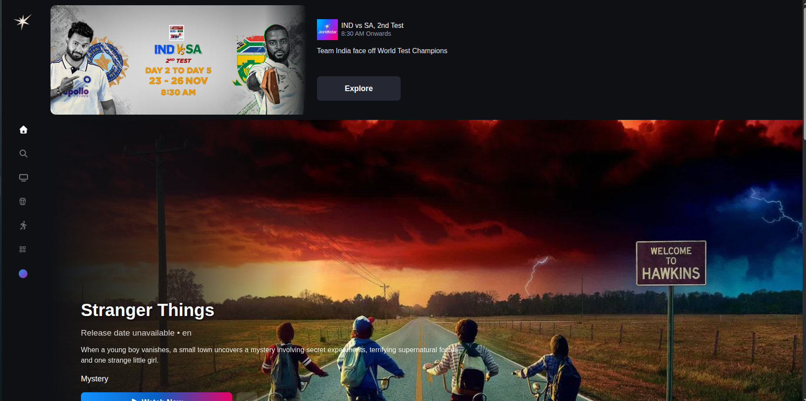
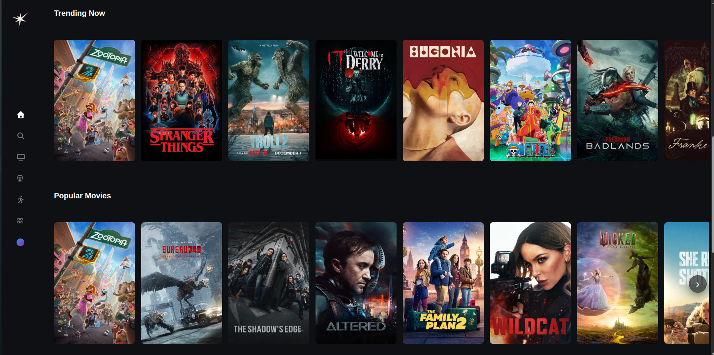
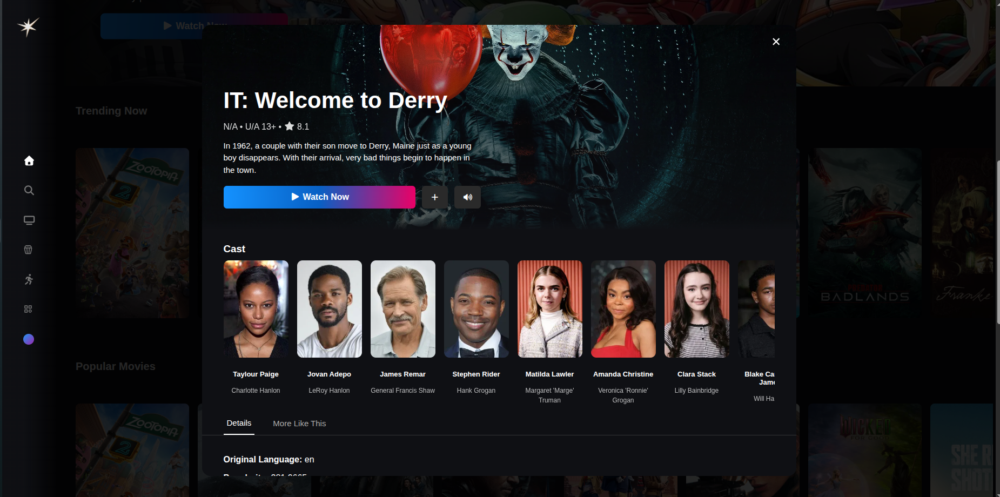

## JioHotstar – Clone

A fully responsive JioHotstar UI clone built with React, replicating the look & feel of the original platform.
The app consumes The Movie Database (TMDB) API to display movies, TV shows, banners, and categories with optimized performance using lazy loading and Intersection Observer.
## 🚀 Tech Stack

-> React 18

-> Vite (fast development build)

-> React Router DOM

-> Context API (global state management)

-> TMDB API (movies & TV shows data)

-> React Intersection Observer

-> CSS / Mui

  ## 🚀 Features


#### 🧩 General

-> Pixel-perfect UI inspired by JioHotstar

-> Fully responsive (mobile, tablet, desktop)

-> Clean & reusable component-based architecture

-> Optimized API calls with centralized configuration

-> Smooth scrolling & animations

###Note: 
-> Use 1111 as OTP for Login


### 💻 Home Page

-> Large Hero / Banner carousel (popular & trending content)

-> Rails for:

Trending

Popular Movies

Top Rated

TV Shows

Recommended content

-> Horizontal scrollable sections similar to Hotstar UX


### 🔍 Browsing & Content
-> Movie & TV show listings using TMDB

-> Dynamic category-based rows

-> Hover effects with action overlays

-> Movie / show details page with:

Overview

Ratings

Release date

Language

Poster & backdrop


### ⚡ Performance Optimizations

-> Lazy loading for pages using React.lazy & Suspense

-> Lazy loading images using IntersectionObserver

-> Images load only when inside viewport

## Installation


### 1. Clone the repository

```bash
https://github.com/krutikD-dev/JioHotStar
```
### 2. Install dependencies
```bash
npm i
```
### 3. Start the development server
```bash
    npm run dev
```
### 4. Build the project for production
```bash
npm run build 
```

## 🔗 API Reference

####  BaseURL:

```http
  https://api.themoviedb.org/3

```

#### Trending Movies

```http
   /trending/movie/day
```

#### Popular Movies

```http
   /movie/popular

```

#### Top Rated Movies

```http
   /movie/top_rated

```
#### 🔑 Note:
You must create an account on TMDB and generate an API key.
Store it securely in an .env file:

#### 🧪 Key Libraries Used

-> react-intersection-observer – viewport-based rendering

-> react-router-dom – client-side routing

-> axios / fetch – API handling

-> React.lazy & Suspense – page-level lazy loading


## Screenshots





